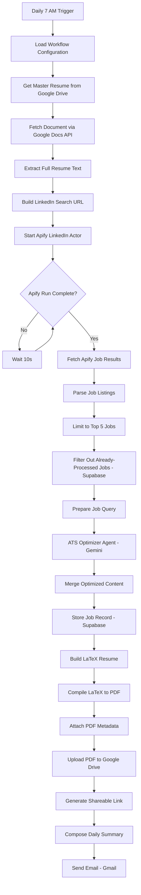

# AI ATS Resume Agent

An autonomous, n8n-orchestrated pipeline that discovers relevant job openings on LinkedIn, scores them against a master resume, and generates a tailored, ATS-optimized PDF resume for each match — fully unattended, on a daily schedule.

---

## Overview

Manually tailoring a resume for every job application is repetitive and slow: rewriting bullet points, hunting for keywords, reformatting, and tracking what's already been applied to. This project removes that bottleneck by turning a single master resume into multiple job-specific, ATS-optimized resumes every day, with zero manual steps between "job posted" and "PDF in your inbox."

The system is built entirely as an **n8n workflow** that chains together job scraping, an LLM agent, LaTeX-based PDF generation, cloud storage, and email delivery into one scheduled automation.

---

## Key Capabilities

**Intelligent Job Discovery** — Triggers a LinkedIn-scraping Apify Actor every day, builds the search URL from configurable criteria, and polls the Actor run until results are ready.

**Duplicate-Aware Filtering** — Caps processing to the top 5 jobs per run and checks each one against a Supabase-backed history table before spending any LLM budget on it, so the same listing is never optimized twice.

**AI-Powered ATS Optimization** — A LangChain agent backed by Google Gemini reads the master resume and each job description, then rewrites and re-prioritizes resume content to match the role's language and requirements — without inventing experience that isn't there.

**Automated LaTeX → PDF Generation** — The agent's output is assembled into a LaTeX document in code, then compiled to a production-quality PDF via a hosted LaTeX build service, so no local LaTeX installation is required.

**Delivery Automation** — Each finished resume is uploaded to Google Drive, converted into a shareable link, and the day's batch is summarized and sent straight to your inbox via Gmail.

---

## How It Works

The diagram below reflects the actual node graph in `workflow/ats-resume-agent.json`, including the asynchronous Apify polling loop.



Deduplication happens twice by design: once *before* the Gemini agent runs (to avoid wasting LLM calls on jobs already seen) and once *after* generation (to persist the final record), which is why Supabase appears at two points in the flow.

---

## Technology Stack

| Layer | Technology | Role in this project |
|---|---|---|
| Workflow Orchestration | n8n | Hosts and schedules the entire 26-node pipeline |
| AI Agent / LLM | Google Gemini | Powers the ATS Optimizer Agent via n8n's LangChain agent node |
| Job Discovery | Apify | LinkedIn-scraping Actor, invoked through a run-and-poll REST pattern |
| Database | Supabase | Stores processed-job history to prevent duplicate resume generation |
| Resume Source | Google Docs / Drive API | Master resume is pulled live via the Google Docs REST API |
| Document Storage | Google Drive | Hosts generated PDFs and produces shareable links |
| Notifications | Gmail | Sends the daily summary email |
| PDF Generation | LaTeX (via a hosted LaTeX build API) | Converts agent output into a compiled, professional PDF |
| Scripting | JavaScript | Used in every n8n Code node for parsing, transforms, and LaTeX templating |

---

## Repository Structure

```text
AI-ATS-Resume-Agent/
│
├── workflow/
│   └── ats-resume-agent.json     # Importable n8n workflow definition
│
├── screenshots/
│   └── workflow.jpg              # Workflow canvas screenshot
│
├── .env.example                  # Required environment variables (see below)
├── .gitignore
├── LICENSE
└── README.md
```

---

## Setup

1. **Import the workflow** — In n8n, go to *Workflows → Import from File* and select `workflow/ats-resume-agent.json`.
2. **Connect credentials** — The workflow expects n8n credentials configured for Google Drive/Docs, Gmail, and Supabase (set these up under *Credentials* in n8n; they aren't stored in the JSON).
3. **Set environment variables** — Copy `.env.example` to `.env` and fill in:

   | Variable | Purpose |
   |---|---|
   | `APIFY_TOKEN` | Authenticates requests to your Apify Actor |
   | `SUPABASE_URL` | Your Supabase project URL |
   | `SUPABASE_KEY` | Supabase service/anon key for the job-history table |
   | `GOOGLE_DOC_ID` | Document ID of your master resume in Google Docs |
   | `USER_EMAIL` | Address the daily summary email is sent to |
   | `GEMINI_API_KEY` | API key for the Google Gemini chat model |

4. **Activate the workflow** — Once credentials and variables are in place, toggle the workflow on; it runs automatically at 7 AM daily.

---

## Use Cases

* Software Engineering applications
* AI/ML Engineering applications
* Data Science applications
* Technical Program Management roles
* Product Management roles
* High-volume job search automation

---

## Future Roadmap

**Version 2**
* Resume match-score engine
* Skill gap analysis
* AI-generated cover letters
* WhatsApp notifications
* Application tracking dashboard

**Version 3**
* Vector search and semantic job matching
* Multi-resume strategy (role-family templates)
* Autonomous application submission
* Interview preparation agent
* Career intelligence dashboard

---

## Engineering Highlights

* Multi-service cloud integration (Google Workspace, Apify, Supabase, Gmail)
* Asynchronous job handling via a poll-and-wait pattern for long-running Actor runs
* LLM-agent-driven content rewriting with grounding in the source resume
* Two-stage deduplication to control both LLM cost and storage correctness
* Code-generated LaTeX templating compiled through a hosted build API — no local LaTeX dependency
* Fully scheduled, event-driven automation requiring no manual trigger

---

## License

Released under the MIT License.
